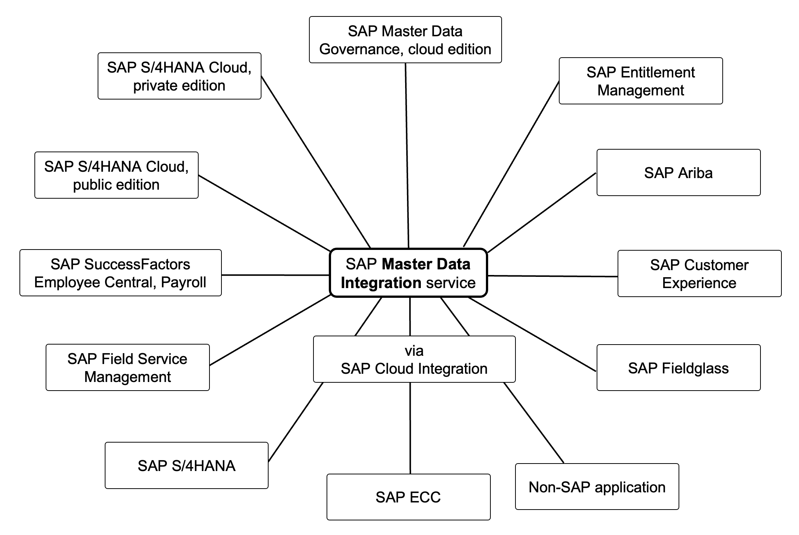

<!-- loiodab76d5506a44c8e85f314fc3be30e13 -->

# What Is Master Data Integration?

Multi-tenant cloud service in the Intelligent Enterprise. 

SAP Master Data Integration service is a central master data hub. Applications integrate with SAP Master Data Integration to synchronize their local master data databases with the master data database of the central hub. In a typical setup, there is exactly one tenant of SAP Master Data Integration for each landscape. Application tenants of the same landscape integrate against the same tenant. The tenant helps to ensure that all applications within this landscape arrive at a consistent view on master data. The following figure illustrates the situation:

SAP Master Data Integration focuses exclusively on the integration aspect regarding master data. This is achieved via replicating master data records. SAP Master Data Integration enables applications to do initial loads of master data, and afterwards stay in sync with the master data database of SAP Master Data Integration. Administrators can control which data is to be synced with which applications, monitor the replication, and comply with data protection and privacy regulations. For more details on the features of SAP Master Data Integration, see [Features](../features/features-832c2df.md) .

Master data processes such as consolidation, data quality control, and central governance are not in the scope of SAP Master Data Integration. These processes can be implemented by leveraging [SAP Master Data Governance, cloud edition](https://www.sapstore.com/solutions/77000/SAP-Master-Data-Governance%2C-cloud-edition) , which integrates with SAP Master Data Integration service.

The Cloud Integration capability of the SAP Integration Suite can be used to integrate the following with SAP Master Data Integration.

-   Non-SAP applications

-   SAP on-premise applications

Cloud Integration comes with special support for integrating with SAP Master Data Integration. For more details, see [SAP Cloud Integration](https://help.sap.com/docs/CLOUD_INTEGRATION?locale=en-US) .

SAP Master Data Integration service doesn't support arbitrary but only specific master data objects. The supported master data objects are adhering to the SAP One Domain Model. For more details on the SAP One Domain Model support, see [Integration Models](integration-models-8882bf9.md) . For more information on the SAP One Domain Model, see [SAP One Domain Model](https://help.sap.com/docs/SAP_ODM/ea7614c1cd0349e58d7f2b04b562d625/2aa15254bfac45a6970d26b6192093cc.html) .

To create a tenant of SAP Master Data Integration, an SAP Business Technology Platform global account is required.The service is cross-consumable from any SAP Business Technology Platform data center.For more details on consuming SAP Master Data Integration, see [Data Center Availability](data-center-availability-ab183ca.md) and [Pricing](pricing-741ef3f.md) .

For more information on the available integration from SAP applications into SAP Master Data Integration, see [Integration](../integration/integration-a504461.md) .

